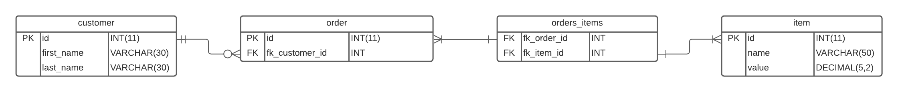

# SQL Database Design



## customer

```SQL
CREATE TABLE customer (
	id INT PRIMARY KEY AUTO_INCREMENT,
	name VARCHAR(50) NOT NULL
);
```

## order

```SQL
CREATE TABLE order (
	id INT PRIMARY KEY AUTO_INCREMENT,
	fk_customer_id INT NOT NULL,
	FOREIGN KEY (fk_customer_id) REFERENCES customer(id)
);
```

## orders_items

```SQL
CREATE TABLE order (
	fk_order_id INT NOT NULL,
	fk_item_id INT NOT NULL,
	FOREIGN KEY (fk_order_id) REFERENCES order(id),
	FOREIGN KEY (fk_item_id) REFERENCES item(id)
);
```

## item

```SQL
CREATE TABLE order (
	id INT PRIMARY KEY AUTO_INCREMENT,
	name VARCHAR(50) NOT NULL,
	value DECIMAL(5,2) NOT NULL
);
```